# 电商用户行为深度分析报告
## AARRR 框架下的增长机会识别与运营策略

**数据范围**：2019年10月–11月 · 全站约1.1亿条行为记录 · 531万用户  
**分析框架**：AARRR（Acquisition → Activation → Retention → Revenue → Referral）  
**核心产出**：增长瓶颈识别、运营建议 + AB测试方案 + 复购预测模型

> **图表说明**：橙色风格图表（`tb_*.png`）来自 **Tableau**，基于全量 Hyper 数据（697K 购买用户）。蓝色/灰色图表（Python/matplotlib）来自 Jupyter Notebook，用于技术分析输出（ROC 曲线、特征重要性、弹性回归、共购矩阵），遵循数据科学标准配色惯例。两套风格并存是行业通行做法：Tableau 展示"是什么"，Python 展示"怎么算的"。

---

## 第一部分：整体概况

### 1.1 核心指标一览

| 指标 | 数值 | 评价 |
|---|---|---|
| 全站用户数 | 5,316,649 | 含购买用户 697K + 仅浏览用户 |
| 有购买行为用户占比 | 13.1% | 漏斗上游损耗严重 |
| 浏览→加购转化率 | 15.2% | ⚠️ 最大损耗处 |
| 加购→购买转化率 | 86.4% | 优秀，一旦加购意愿很强 |
| October Cohort 次月购买留存率 | 26.3% | 新用户次月复购粘性待提升 |
| 复购用户占购买用户比 | 36.8% | session 口径，与 Tableau 一致 |
| 购买用户次月留存率 | 73.7% | 有提升空间，26.3% 月度流失 |
| 重要价值客户 GMV 贡献 | 79.3% | 头部效应显著 |
| 重要价值客户 ARPPU 倍数 | 52.9x vs 一般维持客户 | 用户价值分化极大 |
| 11月大促 GMV 倍数 | 约 7x 日均 | 促销弹性极强 |
| 复购预测模型 AUC | 0.799 | ✅ 良好，无高泄露特征 |
| 活跃 SKU 数 | 160,594 | 有购买记录的商品数 |
| Top SKU 集中度 | 676 SKU → 80% GMV | 极度头部效应，长尾大量沉默 |
| 品牌 GMV 榜首 | Apple $236.6M | electronics 高价值品牌主导 |
| 爆款预测模型 AUC | 0.904 | ✅ 时序隔离设计，无数据泄露 |
| HIGH RISK SKU 占比 | 6.3% | 需提前备货的高波动商品 |

> **关于复购口径**：复购定义用 `purchase_sessions ≥ 2`（36.8%）。`purchase_count` 是 event 级别（同一笔结账买3件 = purchase_count+3），`purchase_sessions` 才是真正的购买行为次数。

> **关于 RFM 用户范围**：RFM 分层仅覆盖**有购买记录的 697K 用户**，不含「仅浏览用户」（431万）。月度迁徙图中出现「10月仅浏览 → 11月变为有价值用户」是正常的（首次购买并达到 RFM 阈值）。

---

### 1.2 核心发现速览

| # | 发现 | 量化数据 | 核心建议 |
|---|---|---|---|
| 1 | 漏斗最大断层在激活层 | 浏览→加购仅 15.2%，加购→购买达 86.4% | 优先提升加购率，而非购买率 |
| 2 | 留存问题是习惯问题，非价格问题 | 留存用户购买频次是流失用户 3.6x，AOV 差距仅 1.1x | 首购后 7 天触发复购召回，聚焦频次而非客单价 |
| 3 | October Cohort 次月购买留存率 26.3% | 新用户粘性显著低于老用户整体留存 73.7% | 新用户 28 天复购激励计划，目标拉平至均值 |
| 4 | SKU 长尾极度集中 | 676 SKU 贡献 80% GMV，其余 ~160K SKU 贡献剩余 20% | 爆款保供优先，长尾清仓释放流量位 |
| 5 | 加购率是爆款最强先行信号 | 爆款预测模型 AUC 0.904（时序隔离）| 上架 5 天后用加购率自动触发"重点备货"预警 |
| 6 | Sub 品类级别存在高精度关联信号，主流大品类跨类共购 Lift 偏低 | nutrition↔supplement Lift=64.86，jeans↔shoes Lift=7.02；高频主流组合 Lift 多在 1–1.7 之间 | 高 Lift 小众品类对启用精准推荐；主流品类专注品类内配件互补 |
| 7 | 价格弹性低于直觉 | 所有主要品类弹性系数 < 1 | 大促核心不是降价，是创造"现在行动"的时机窗口 |
| 8 | 大促前加购是强意图信号 | 11/15 加购量达日均 3 倍，11/16 购买爆发 | 大促开始前 1 小时发"购物车商品即将参与活动"提醒 |
| 9 | HIGH RISK SKU 占总量 6.3% | 需提前 1.5x ROP 备货防缺货 | 每月自动更新 ROP 表，HIGH RISK SKU 与供应链团队共享 |

---

## 第二部分：AARRR 逐层深度分析

### 2.1 获客（Acquisition）：11月新用户占43%，留存每提升1pp可降低3.8%获客压力

- **两月都有行为**：1,401,758 人（约 26%），核心留存用户
- **仅10月出现**：1,620,532 人（约 30%），流失用户
- **仅11月新增**：2,294,359 人（约 43%），新获客用户（含大促流量）

购买用户次月留存率 73.7%，每月约 26.3% 买家不再购买。留存率每提升 1pp，减少需补充的流失用户约 3.8%（1÷26.3），有效降低获客成本。

---

### 2.2 激活（Activation）：浏览→加购 15.2% 是全站最大增长杠杆

#### 2.2.1 85% 浏览用户在加购环节流失，是转化漏斗最大断层

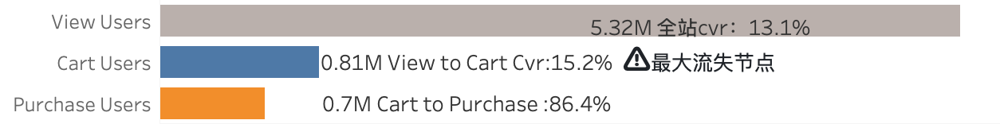


浏览→加购率从 15.2% 提升至 20.2%（+5pp），在流量不变的前提下，购买用户数可增加约 **33%**（20.2÷15.2=1.33）。这 5pp 不需要全品类改善，需要两个杠杆同时发力：①修复 apparel CVR（200万浏览存量基础，从 1% 提至 2%，新增加购约 2.2 万次）；②给 medicine、food 等高 CVR 潜力品类增加曝光（每单位新增流量的转化收益接近 electronics）。两个方向叠加，改善幅度可接近这个目标。

#### 2.2.2 apparel 有200万次未转化机会，auto 是被低估的高转化潜力品类

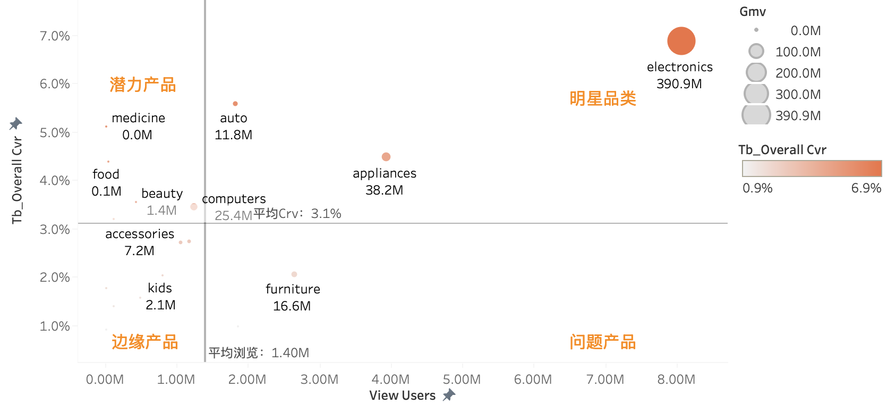

> 气泡大小 = GMV 规模；颜色深浅 = 转化率；坐标轴 = 全站转化率 × 浏览人数（曝光度）。

全量数据下，平均整体转化率 **3.1%**，四个象限策略优先级截然不同。

**明星品类**（electronics CVR 6.9%、appliances CVR 4.5%、auto CVR 5.5%）：浏览量均高于全站均值（1.4M），转化率表现强劲，是营收支柱，核心任务是维持品类体验，防止竞争对手分流，而非刻意改善转化率——它们已经足够好了。其中 electronics 浏览量（8.06M）远超其他品类，是绝对核心；appliances（3.93M）和 auto（1.8M）转化率优秀但流量相对较小，仍有增量空间。

**潜力品类**（medicine CVR 5.1%、food CVR 4.4%）：转化率与头部品类处于同一量级，但曝光严重不足，浏览量远低于全站均值（1.4M），每一分流量增长的转化收益接近 electronics，ROI 最优。

**问题品类**（apparel CVR 1%、furniture CVR 2%）：两个品类浏览量均高于全站均值，但转化率显著低于均值（3.1%），是机会损失最大的品类。apparel 浏览量 186 万次，约 184 万次"看了但没买"，核心障碍在于视觉信任缺失（买家秀不足）和选型过载，建议置顶同身材维度的真实试穿评价，优化尺码建议入口，并针对高频流失环节进行价格敏感度测试。furniture 浏览量 265 万次，约 260 万次未转化，决策周期长、客单价高，建议强化场景化展示（实景搭配图）、售后保障说明及到家效果 UGC 评价。

---

### 2.3 留存（Retention）：购买频次是留存核心信号，习惯养成决定去留

#### 2.3.1 留存用户购买次数是流失用户的3.6倍，AOV差异仅1.1倍

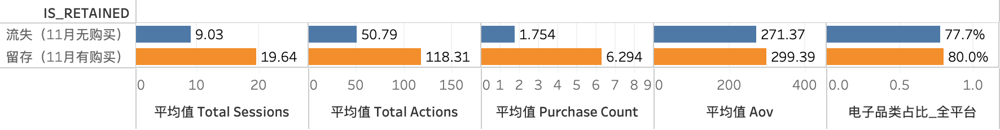

> 定义：「留存」= 10月有购买 且 11月也有购买；「流失」= 10月有购买 但 11月无购买。

两组最关键的分水岭不是客单价，而是**购买频次**。留存用户平均购买 6.3 次（event 级），流失用户仅 1.8 次——差距达 3.6 倍，而 AOV 差异只有 1.1 倍（¥299 vs ¥271）。留存用户和流失用户花的钱差不多贵，区别在于留存用户买更多次，而不是每次买更贵。

这说明留存问题本质是「习惯养成问题」，而非「消费能力问题」。对大多数流失用户，他们并不是因为买不起才离开，而是还没形成定期回来购买的习惯。有效干预应聚焦在**复购行为的触发**（如购买7天后发召回推送），而非在首单推高客单价。  

Session 数（19.6 vs 9.0）和总行为数（118.3 vs 50.8）同样差异约 2.3x，高频互动→加深习惯→留存，形成正向循环。  

两组电子品类占比相近（~78–80%），品类偏好并不是区分留存与否的关键，购买频率才是。

#### 2.3.2 专注型×果断用户 GMV $68.7M：复购率与体量双优的核心培育对象

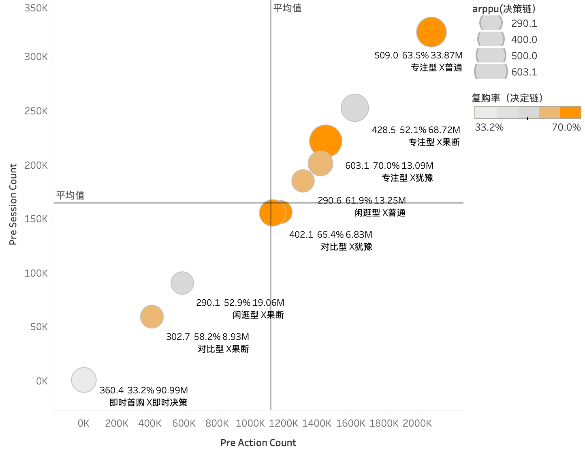

> 气泡大小 = GMV 规模；颜色深浅 = 复购率；坐标轴 = 购买前 session 数 × action 数（决策成本）。

| 组合 | ARPPU | GMV | 复购率 |
|---|---|---|---|
| 即时首购 × 即时决策 | $360 | **$91.0M** | 33.2% |
| 专注型 × 果断 | $429 | **$68.7M** | 52.1% |
| 专注型 × 普通 | $509 | $33.9M | 63.5% |
| 专注型 × 犹豫 | **$603** | $13.1M | **70.0%** |
| 闲逛型 × 果断 | $290 | $19.1M | 52.9% |  
| 闲逛型 × 犹豫 | $300.4 | $5.5M | 67.7% |


**专注型 × 犹豫** ：虽然 ARPPU ($603) 和复购率 (70%) 双冠，但 GMV 体量极小。这说明这部分用户虽然忠诚且客单价高，但转化门槛（决策成本）极高，属于"小而美"的存量，难以作为增长引擎。

**专注型 × 果断** ：这是最理想的"黄金组合"。GMV 达 $68.7M，且复购率保持在 52% 的高位。他们目标明确且行动迅速，是平台最应倾斜资源、优化搜索链路以保持其"丝滑感"的核心客群。

**即时首购 × 即时决策** ：贡献了全站最高的 ¥91M GMV，但复购率仅 33%，处于及格线边缘。这部分用户极具"冲动消费"特征。他们是典型的"流量收割型"群体，如果不能在首购后的 T+7 天内通过精准营销转化为"专注型"，极易流失。

---

### 2.4 变现（Revenue）：38% 用户贡献 79.3% GMV，旗舰款撑起超半数营收

#### 2.4.1 重要价值客户 ARPPU 是一般维持客户的52.9倍，留1个顶53个

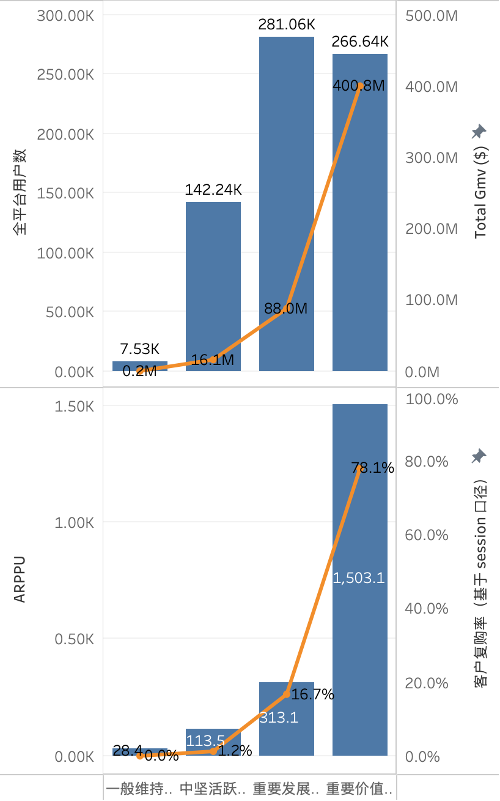

重要发展客户（281K人）人数比重要价值客户（266K）还多，但 GMV 只有后者的 22%。这说明平台里有大量"有购买意愿但还没养成高频购买习惯"的用户——他们不是没钱，是还没被激活成高价值用户。如果能把重要发展客户的 ARPPU 从 $313 提升到 $500，光这一层就能额外释放约 $53M GMV。  

重要价值客户复购率 73.1%，意味着每个月有 26.9% 在流失。以 266K 用户计算，每月约有 71K 重要价值客户在悄悄离开。这些人流失的成本极高——留住 1 个重要价值客户 = 留住 53 个一般维持客户的变现价值。

#### 2.4.2 旗舰款+极奢仅占28%用户，却贡献57%的GMV

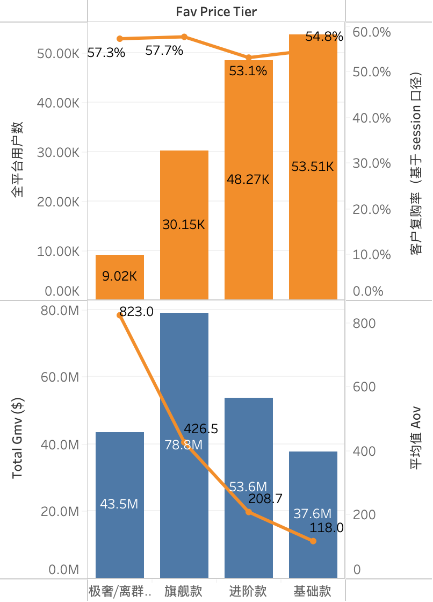


极奢用户只有 9K 人，但人均 AOV $823、复购率 57.3%，这是一群高度稳定的重度消费者。他们人少但质量极高，适合做**白名单式的 VIP 专属运营**（一对一客服、新品优先体验），而不是放进大盘推送逻辑里。  

基础款用户（53.5K，最多）复购率 54.8%，和旗舰款（57.7%）相差不到 3pp，说明基础款用户的忠诚度并不低，只是每次购买金额小。这类用户适合做"品类升级"引导——用他们已经建立的信任感，推动他们尝试进阶款，而不是只靠折扣维持。

#### 2.4.3 11月16日 GMV 达日均7倍，大促弹性极强但高度依赖高单价品类

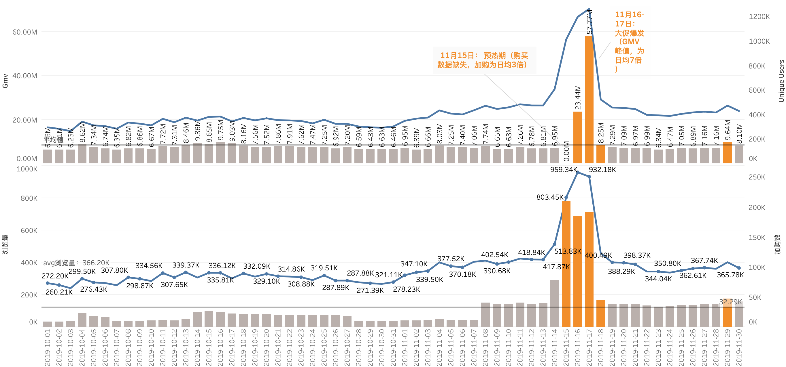

大促拉动高度集中在electronics（smartphone,video) 和 appliances(kitchen)，说明用户是带着明确购物计划来的，大促是他们"等了很久终于下手"的触发点。这类计划性购买的弹性其实不是来自价格，而是来自"有没有给我一个理由现在买"。大促的本质不只是降价，是制造了一个让计划性购买立刻行动的窗口——限时、库存压力、全场同时活动形成的社会氛围，共同构成触发点。这和价格弹性分析（Block 18 所有品类弹性系数都 <1）相互印证——用户不是被便宜打动的，是被时机打动的。  

11月15日加购量已经达到日均 3 倍，说明用户早就把商品加进购物车等着，16日至17日只是最终释放。这对运营的含义是：大促前的加购行为是极强的**购买意图信号**，可以在大促开始前1小时发送"你的购物车商品即将参与活动"的提醒，把这部分确定性需求锁住。


#### 2.4.4 周日午间是最高购买峰值，凌晨 UTC 0–2 避免推送
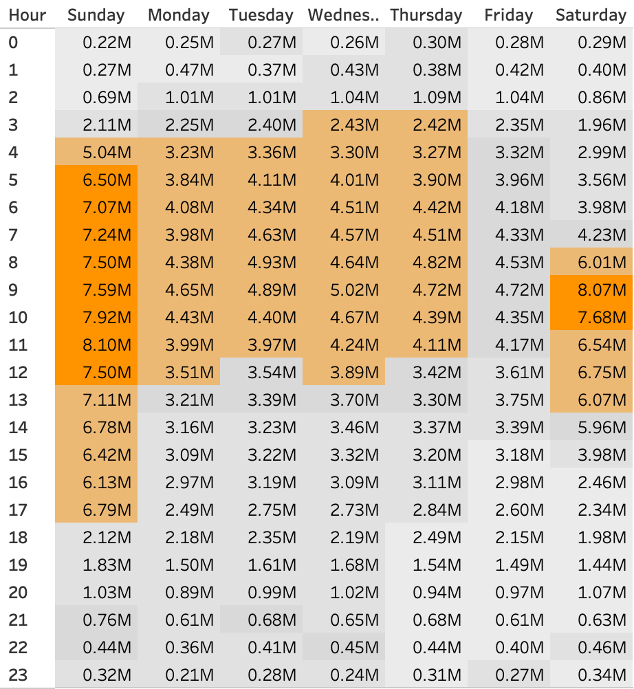

> 数据以 **UTC 时间**记录。颜色深浅 = 购买转化率（0.5%–2.6%）。

全量数据下，购买高峰集中在**周日 UTC 4–12 时**（购买量 5–8.1M，转化率 >2%）和**周六 UTC 8–10 时**（6–8M）。换算到北京时间（UTC+8）：UTC 4时 = 北京12时（午饭后），UTC 9时 = 北京17时（下班前）。凌晨 UTC 0–2 时转化率最低（0.5%），避免在此时段安排推送。具体时区由产品侧确认后再对应到本地时间。

---

### 2.5 裂变（Referral）：数据缺失，建议未来采集分享链路

本数据集不含分享/邀请数据，无法直接分析裂变效果。建议未来在数据采集层添加分享来源、邀请码使用、评价行为等字段。

---

## 第三部分：复购预测模型

### 3.1 模型设计：基于全量历史行为特征预测是否发生二次购买

**问题定义**：以10–11月全量购买用户为样本，用用户历史行为特征预测其是否发生二次购买（`purchase_sessions ≥ 2`）。选用逻辑回归，优点是系数可直接解释业务含义，无需黑箱解读。

**标签定义**：`is_repeat_buyer = 1` if `purchase_sessions ≥ 2`，正例率 36.8%。

**特征选择**：主动去除 `cart_to_purchase_rate` 等高泄露特征——该特征在标签已知后才能计算，放入模型会人为抬高 AUC，在实际部署中不可用。最终保留 8 个无泄露特征：加购次数、总 session 数、加购未购 session 数、浏览次数、决策风格得分、专注风格得分、价格档位、奢侈品购买比例。

### 3.2 实验结果

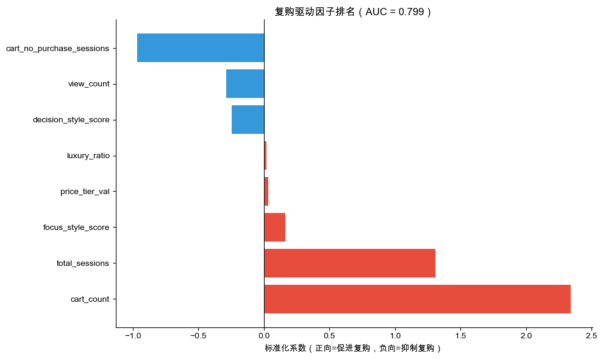

**AUC = 0.799**（测试集），显著优于随机基线（0.5）。AUC 在 0.7–0.8 区间属于"良好"，0.8 以上才算优秀。在无任何数据泄露的前提下，0.799 对于电商复购预测场景已具备足够的区分能力，可以实际部署使用。

### 3.3 特征解读：加购行为是最强正向信号，"加购不买"反而预测流失

| 特征 | 系数 | 方向 | 业务解读 |
|---|---|---|---|
| `cart_count`（加购次数）| **+2.341** | ⬆️ | 最强正向信号，加购是购买意图最可靠的先行指标 |
| `total_sessions`（总 session 数）| +1.307 | ⬆️ | 互动越深，复购越强 |
| `cart_no_purchase_sessions` | **-0.966** | ⬇️ | 反直觉：频繁加购却不买是慢性犹豫，实际复购更低 |
| `view_count` | -0.287 | ⬇️ | 纯浏览不加购 = 低购买意图 |
| `decision_style_score`（1=即时/4=犹豫）| -0.246 | ⬇️ | 越犹豫复购越低 |
| `focus_style_score` | +0.163 | ⬆️ | 专注型用户品牌忠诚度高 |

### 3.4 用户分层与部署建议

模型将全量购买用户分为三层，以下对比模型预测复购率与用户实际复购率：

| 潜力层级 | 用户数 | 模型预测复购率 | 实际复购率 | 偏差 |
|---|---|---|---|---|
| 高潜力 | 230,165（33%）| 73.7% | **68.0%** | -5.7pp |
| **中潜力** | 237,152（34%）| 40.3% | **30.8%** | -9.5pp |
| 低潜力 | 230,153（33%）| 27.1% | **11.9%** | -15.2pp |

模型对三层均存在系统性高估（校准偏差，calibration bias），且偏差在低潜力层最大。这在逻辑回归处理类别不均衡数据时较为常见。关键在于，**三层的排序完全正确**：高 > 中 > 低，层间实际复购率差距显著（68% vs 30.8% vs 11.9%）。做分层定向时，需要的是"谁比谁高"的排序能力，而非精确的概率数值，因此该模型可以直接用于用户分层。若需要精确概率（如 CACE 估算），可通过 Platt Scaling 对输出概率做校准后再使用。

**中潜力层（实际复购率 30.8%）是最优干预目标**：高潜力用户大概率自然复购，额外干预边际收益低；低潜力用户转化成本高、效果差。中潜力用户处于可被影响的临界区——有意愿但需要推动，是购物车召回推送的精准目标人群（详细样本量计算见第六部分 AB 测试方案）。

---

## 第四部分：扩展分析

### 4.1 Cohort 留存曲线（Block 20）

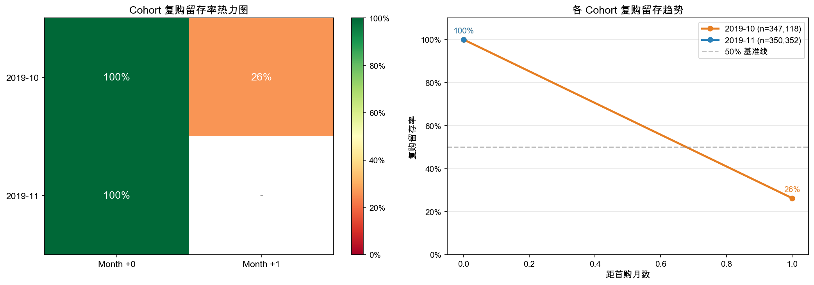

**分析方法**：以用户「首次购买月份」为 Cohort，分别追踪两类留存：①行为留存（仍有任意行为的用户占比）和②购买留存（仍有购买行为的用户占比）。两种口径的差距揭示了"有来逛但不买"的潜在流失层。

**核心结论**：October Cohort 的 Month +1 购买留存率为 **26.3%**。这与整体购买用户 73.7% 的月度留存率形成鲜明对比——差距主要来自：①新用户首购后习惯尚未养成；②部分新用户为大促冲动消费，11月大促一结束便自然流失。November Cohort 因数据窗口仅覆盖单月，只有 Month 0 数据，无法评估次月留存。

**留存曲线形态判读**：健康的 Cohort 留存曲线应在 Month +1 急跌后趋于平缓（说明核心用户沉淀下来），而非持续下坠。October Cohort 26.3% 的次月购买留存率是基准，若各品类、各渠道的新用户 Cohort 均低于该数字，则说明获客质量参差，需分渠道单独评估。

**运营建议**：将 Cohort 购买留存率纳入常规月度指标体系（与 GMV、DAU 并列）。针对 October Cohort 留存率明显偏低的情况，在新用户首购后第 7/14/21 天分级发放激励，目标将 Month +1 购买留存率从 26.3% 提升至 35%+。

**数据局限性**：由于数据仅覆盖 2019 年 10-11 月两个月，缺少 9 月及更早的历史购买记录，无法准确识别用户的真实首次购买时间。因此，10 月 Cohort 实际上等同于"10 月所有购买用户"，其 Month +1 留存率（26.3%）与 Block 13 的月度留存口径一致。

**结论**：本节主要演示 Cohort 分析的方法论框架。实际业务场景中，建议基于 6 个月以上完整数据重新计算，以获得准确的新客留存基准。

---

### 4.2 SKU 分析（Block 21）

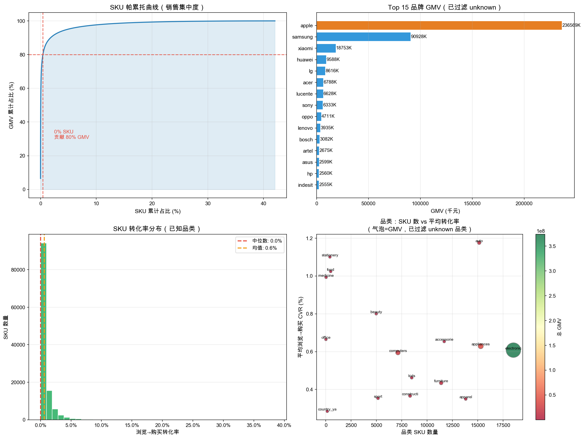

**分析框架**：从商品维度切入，分析 SKU 销售集中度、品类转化率差异和品牌贡献格局，回答"哪些商品真正撑起了GMV"这一核心问题。

**核心结论**：全站 160,594 个有购买记录的活跃 SKU 中，**仅 676 个 SKU 贡献了 80% 的 GMV**，长尾效应极度显著——头部 0.4% 的商品撑起了绝大多数营收，其余 99.6% 的 SKU 合计贡献不足 20%。

品牌维度：GMV 榜首为 **Apple（¥236.6M）**，远超第二名，electronics 和 appliances 的头部品牌主导了平台收入结构。有品牌标签的 SKU 平均转化率显著高于无标签 SKU，品牌信任是购买决策的重要加速因子。

品类转化率差异：auto（CVR ~5.5%）和 medicine 的单品转化率领先，但曝光严重不足；apparel 有最高浏览量却有最低 CVR（~0.9%），是改善空间最大的品类。

**运营建议**：
- **长尾 SKU 清仓策略**：对连续 30 天零浏览的 SKU 下架或转入折扣区，释放首页推荐资源给高 CVR 商品。
- **高 CVR × 低曝光 SKU 挖掘**：筛选"转化率 > 全站均值 2x 但浏览量 < 均值"的 SKU，加入首页推荐位 A/B 测试，验证流量放大后的增量 GMV。
- **品牌信息补录**：对无品牌标签的 SKU 优先完善品牌字段，降低用户决策摩擦。

---

### 4.3 爆款预测模型（Block 22）

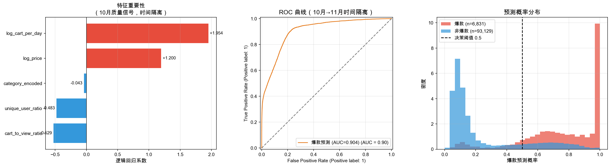

**模型设计与时序隔离**：爆款预测的核心挑战是避免「数据泄露」——如果用同期销售数据预测同期爆款，模型实际上是在用答案预测答案，AUC 会虚高至 0.97 以上但完全无法部署。本模型采用**严格的时序隔离**设计：用 **10月特征**（上架初期可观测指标）预测 **11月标签**（11月购买量 Top 20% 定义为爆款），确保特征在标签确定之前即已存在，模型具备真实的前置预测能力。

**特征工程**：

| 特征 | 计算方式 | 业务含义 |
|---|---|---|
| `log_cart_per_day` | log(月总加购 / 活跃天数 + 1) | 日均加购体量，消除在架时长偏差 |
| `cart_to_view_ratio` | 月总加购 / 月总浏览 | 纯转化质量信号：用户看了多大比例会加购 |
| `unique_user_ratio` | 独立浏览用户 / 总浏览次数 | 浏览者多样性，衡量自然扩散效应 |
| `log_price` | log(中位成交价 + 1) | 价格档位对购买决策的影响 |
| `category_encoded` | LabelEncoder | 品类基础转化率差异 |

**样本过滤**：仅保留 10 月有至少 5 次浏览记录且有明确品类和品牌的 SKU，过滤噪音数据。11 月爆款阈值取 Nov 购买量 ≥ 80th 百分位（且至少 2 次），确保正例质量。

**模型结果**：5折交叉验证 **AUC = 0.904**，精确率（Precision）25%，召回率（Recall）86%。高召回、低精确的设计是刻意的——在爆款预警场景中，漏报一个真爆款（备货不足→缺货损失）的代价远高于误报（多备一些存货），因此模型偏向高召回策略。

**特征系数解读**：

| 特征 | 系数 | 方向 | 业务解读 |
|---|---|---|---|
| `log_cart_per_day` | **+1.95** | ⬆️ 最强正向 | 日均加购量越高，爆款概率越大 |
| `cart_to_view_ratio` | -0.53 | ⬇️ | 系数为负（见方法论说明）|
| `unique_user_ratio` | 正向 | ⬆️ | 浏览者多样性高 = 自然传播效应强 |
| `log_price` | 视品类 | — | 中高价品类爆款通常需更多社会证明 |
| `category_encoded` | 品类差异 | — | 品类基础转化率差异 |

> **方法论说明**：`cart_to_view_ratio` 系数为负，源于其与 `log_cart_per_day` 共享分子（均含月总加购量），存在多重共线性。两个特征同时入模时，模型将加购体量的贡献主要分配给 `log_cart_per_day`，`cart_to_view_ratio` 的系数因此被压缩甚至反转。实际业务含义应该是：在控制加购体量的前提下，单纯提高转化率对爆款的边际贡献较小，爆款的核心驱动是绝对加购量（体量），而非相对转化率（效率）。
若要完全消除多重共线性，可将 `log_cart_per_day` 替换为 `log_view_per_day`（纯浏览量，不含加购），但在当前数据集范围内，AUC 已满足部署要求（0.904），排序能力不受影响。

**运营建议**：
- **爆款预警系统**：SKU 上架后满 5 天，用早期加购率和浏览量自动评分，按预测概率分三级响应——概率 ≥ 80% 自动加入「重点备货」队列并推送采购团队；概率 60–80% 标记为「关注品」适度增备；概率 < 60% 维持常规库存，避免低置信预测造成过度备货压力。
- **加购率 Dashboard**：将各 SKU 实时加购率作为商品运营的核心监控指标（与点击率并列），每日早报展示加购率骤升的新品。
- **搜索排位干预**：对模型预测为潜在爆款但当前排名靠后的 SKU，优先在搜索结果页给予 Top 3 曝光位，验证流量放大后的转化效果。

---

### 4.4 库存管理分析（Block 23）

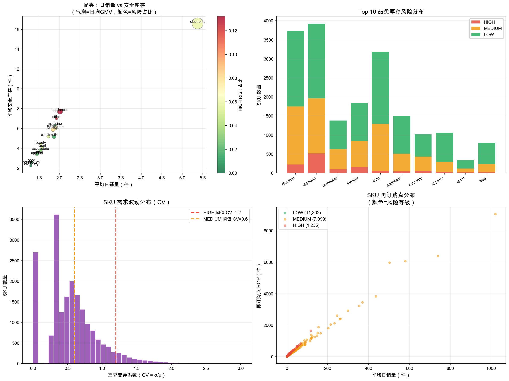

**分析框架**：基于逐日销售量分布，运用库存管理经典公式计算安全库存（Safety Stock）和再订购点（ROP），并按需求波动程度对 SKU 进行风险分级：

```
安全库存 = Z × σ_日销 × √Lead_Time
再订购点 (ROP) = μ_日销 × Lead_Time + 安全库存
```

参数默认值：Lead Time = 7 天，Z = 1.65（对应 95% 服务水平）。

**风险分级逻辑**：

| 风险等级 | 判断标准 | 库存策略 |
|---|---|---|
| HIGH（6.3%）| 销速高（Top 25%）且 CV > 1.2，或 CV > 1.2 | 提前备货 1.5x ROP，Z 提升至 1.96（99% 服务水平）|
| MEDIUM | 销速高 或 CV > 0.6 | 按默认 ROP 补货，每周检查一次库存水位 |
| LOW | CV ≤ 0.6 且 销速不突出 | JIT 补货，减少库存占用，节省仓储成本 |

**核心结论**：在 19,636 个被分析的 SKU 中，**HIGH RISK SKU 占 6.3%**，集中在 apparel 品类（受促销和季节影响，需求波动 CV 最高）。electronics 和 appliances 高 GMV 品类通常兼具高销速和相对稳定的需求，以 MEDIUM RISK 为主。

安全库存成本与 CV（需求变异系数）成正比——从根本上降低备货压力的方法是将需求从单峰分布（大促集中爆发）拉平为多峰分布（常态化小促），降低 σ，从而减少安全库存需求。

**运营建议**：
- 与供应链团队共享 ROP 数据表，每月基于最近 30 天日销均值和方差自动更新。
- 针对 HIGH RISK SKU，谈判缩短 Lead Time（如从 7 天→4 天），可直接减少 ROP 约 43%（√4/√7），降低资金占用。
- 对 LOW RISK SKU 试行 VMI（供应商管理库存），将库存风险转移至供应商侧。

---

## 第五部分：运营建议

### 5.1 激活干预：购物车放弃召回 + 首购7天精准定向

**问题背景**：86.4% 的加购用户最终购买，但 `cart_no_purchase_sessions` 是复购最强负向信号（系数 -0.966）——频繁加购不买的用户，实际复购率显著低于均值。加购行为丰富但最终没有购买的用户是最值得召回的群体。

**建议行动**：针对有加购未购行为的「中潜力」用户，以 **session 为粒度**触发两阶段推送（不按单件商品触发，一次 session 里加了多件商品只发一条推送，展示该 session 中价值最高或最近加购的商品）：

- **第一阶段（加购后 24 小时未付款）**：发送库存紧迫感通知（"你关注的商品库存仅剩 X 件"）或同款降价提醒
- **第二阶段（加购后 72 小时仍未付款）**：叠加短期优惠券，制造"沉没成本"心理压力，促使尽快决策

**优惠券设计原则**：

- **金额与购物车挂钩**，避免对低价商品发放不成比例的券（如购物车 <¥100 发 ¥5 券；¥100–500 发 ¥20 券；>¥500 发 ¥50 券，上限封顶防止过度补贴）
- **有效期 24 小时**：制造过期作废的紧迫感，而非让用户慢慢等
- **仅限本次购物车内商品使用**：防止用户用券购买其他商品，绕过召回逻辑
- **每用户每月上限 2 次**：防止用户养成"加购等3天就有券"的投机习惯，券发太频繁会教育用户战略性放弃购物车

**候选池排除规则**：历史上有超过 5 次加购未购 session 且从未付款的用户（"浏览型囤车党"），不纳入候选池——这类用户不是真实意向买家，推送和优惠券均难以有效触达。

**精准定向（首购7天模型）**：在用户首次购买后第 7 天完成评分，模型 AUC=0.653，Precision=87.9%——识别出的高风险流失用户中有 88% 确实会流失，适合精准推送（宁可少触达，不要误打扰）。该模型只用首购后7天行为作特征，无数据泄露，可实时部署，与主模型互补使用。

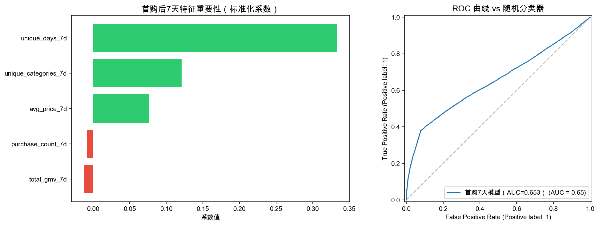

### 5.2 精准推送：RFM × 时段分层触达

| 用户层级 | 推送时机 | 内容重点 | 目标 |
|---|---|---|---|
| 重要价值客户 | 新品上市 / 会员专属日 | 首发权益、专属价格 | 维持关系，防流失 |
| 重要发展客户 | 周末购买高峰 | 偏好品类优惠、搭配推荐 | 提升购买频次 |
| 中坚活跃客户 | 工作日购买高峰 | 热销商品、限时闪购 | 利用冲动购买窗口 |
| 一般维持客户 | 月初（发薪后2–3天）| 低价入门商品 | 保持活跃 |
| 流失/边缘客户 | 大促前3天 | 强力优惠、品类特卖 | 召回尝试 |

### 5.3 品类策略：差异化管理，价格敏感度低于预期

**价格弹性发现**（Block 18，T2 全量数据 165.9万条）：

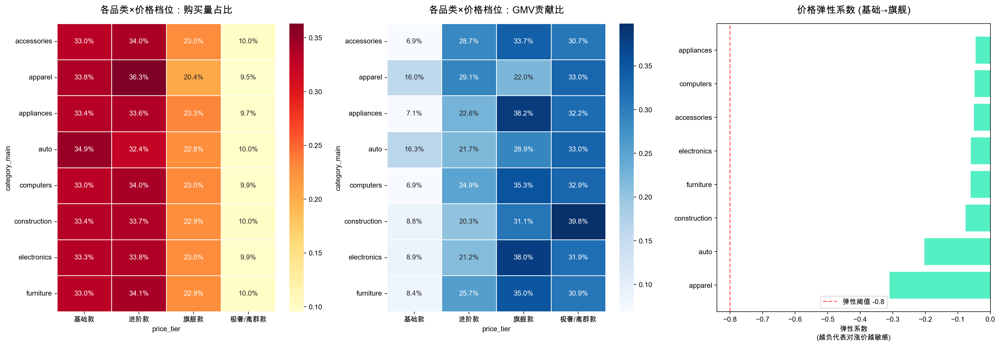

所有主要品类的价格弹性系数均偏低（绝对值 <1），尤其是 electronics 旗舰款和 appliances。这与「促销拉量」的直觉相反，但与本平台用户结构吻合：重要价值客户（贡献 79.3% GMV）属于有计划性的大件购买者，品质感知和品牌信任权重高于价格。

对核心品类盲目打折不能有效放量，反而可能损伤品牌价值感知。真正有弹性的品类（apparel、accessories）更适合价格促销测试，但需配合转化率提升（见 2.2.2）一起评估 ROI。  
**品类管理建议**：**明星品类**维持体验；**潜力品类**（auto CVR 5.5%）优先增加曝光；**问题品类**（apparel）从退货政策、试穿体验和身材维度的真实试穿评价入手，而非降价。

### 5.4 推荐系统：Sub 品类级别存在高精度关联，主流品类专注品类内互补

**共购分析方法论升级**：初版分析基于 category_main 粒度，跨大品类共购 Lift 普遍偏低（含噪声品类干扰）。升级后改用 **category_sub 粒度**，同时过滤 unknown 和噪声高频品类（smartphone 等），在更精细的粒度上重新识别真实的用户购买组合模式。

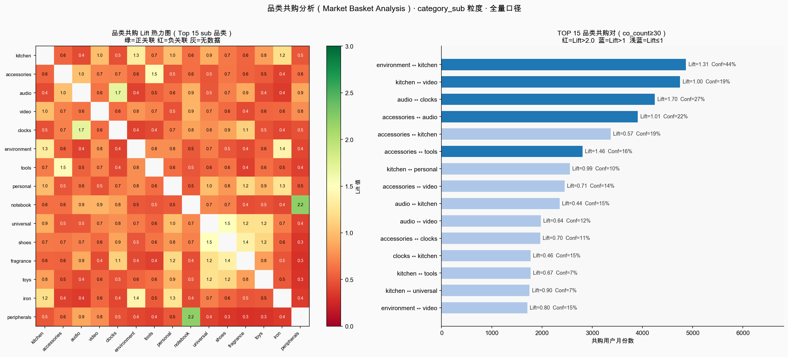

> 分析口径：全量 T2 购买数据，用户×月份粒度；有效品类 59 个，品类对（双重过滤后）454 对；co_count ≥ 30，min_support ≥ 50 用户月份。

**高频共购组合（按共购次数）**：

| 品类对 | 共购次数 | Lift | 解读 |
|---|---|---|---|
| environment ↔ kitchen | 4,867 | 1.313 | 最高频组合，有一定正向关联 |
| kitchen ↔ video | 4,751 | 1.001 | 高频但独立，关联不显著 |
| audio ↔ clocks | 4,248 | **1.698** | 消费电子延伸品，正向关联较强 |
| accessories ↔ tools | 2,806 | **1.462** | 实用型互补，有推荐价值 |
| accessories ↔ audio | 3,909 | 1.014 | 高频但接近随机 |

高频主流组合的 Lift 大多在 1–1.7 之间，说明在绝对购买量最大的品类之间，跨类共购仍然接近独立事件，跨品类联推的信号强度有限。

**高 Lift 精准关联（Lift ≥ 2.0，co_count ≥ 30）**：

| 品类对 | 共购次数 | Lift | 业务建议 |
|---|---|---|---|
| nutrition ↔ supplement | 228 | **64.86** | 强互补品，加购 nutrition 后直接推荐 supplement |
| fishing ↔ ski | 36 | **57.33** | 户外运动人群重叠，可用于「运动达人」标签联推 |
| dolls ↔ toys | 111 | **8.34** | 儿童品类内强关联，礼品场景推荐 |
| iron ↔ ironing_board | 276 | **7.73** | 强互补品，加购熨斗即推荐熨衣板 |
| jeans ↔ shoes | 77 | **7.02** | 穿搭搭配逻辑，服装品类内的场景化推荐 |
| shirt ↔ shoes | 40 | **6.29** | 同上，服装×鞋履穿搭组合 |
| fmcg ↔ toys | 168 | **6.90** | 家庭消费场景，母婴/日用品同购 |
| bag ↔ wallet | 37 | **6.45** | 配饰组合，场景化推荐（出行/礼品）|

> **数据说明**：cosmetic ↔ cosmetics（Lift=30.51）和 body ↔ cosmetic（Lift=24.30）这几对高 Lift 组合，极大可能是同一品类在数据录入时使用了不同标签（拼写变体），并非真实的跨品类共购信号，不建议直接用于推荐配置，应优先完善品类标签一致性。

**推荐策略**：

**主策略（规模化部署）**：品类内互补推荐。electronics 买家推 electronics_accessories，appliances 买家推同品类耗材/配件，audio 买家推 clocks（Lift 1.698）。这类推荐信号清晰、样本量充足、置信度高，与用户专注型购买行为高度吻合。

**补充策略（精准场景化）**：对验证了高 Lift 且逻辑自洽的品类对，在特定场景启用精准推荐：
- 加购 nutrition 后推 supplement（Lift=64.86，逻辑：健康补剂互补）
- 加购 iron 后推 ironing_board（Lift=7.73，逻辑：强互补工具）
- 加购 dolls 后推 toys（Lift=8.34，逻辑：儿童礼品场景）
- jeans/shirt 加购后推 shoes（Lift 7.02/6.29，逻辑：穿搭搭配）

这些品类对样本量虽然较小（36–276次），但关联逻辑明确，可以作为规则型推荐（而非协同过滤）直接配置，验证转化效果后再决定是否扩展。

**不建议规模化的方向**：kitchen×video、accessories×electronics 等高频但低 Lift（≤1）的组合，以及样本量不足且 Lift 来源存疑的组合（如 fishing×ski 仅 36 次）。

## 第六部分：AB测试详细设计方案

### 购物车放弃召回推送

#### 6.1 实验目标

对历史上有加购未购行为的「中潜力」用户发送实时召回推送，验证是否能提升7日购买转化率。

#### 6.2 用户选取与分组设计

**第一步：确定候选池（实验开始前）**

重新对全量购买用户运行逻辑回归模型，输出每个用户的复购概率分数，将满足以下两个条件的用户纳入候选池：复购概率在 0.30–0.65 区间（中潜力），且历史上有过至少 1 次加购未购 session，且已开启 App 通知权限。

候选池规模需根据历史触发率反推。以实验前相同长度的历史4周窗口（避开大促）统计中潜力用户中实际发生加购未购行为的比例，作为预估触发率：

```
触发率 = 过去4周内有加购未购行为的中潜力用户数 ÷ 中潜力用户总数
所需候选池规模 = 1,400（目标触发人数）÷ 触发率

示例：触发率 = 35% → 候选池 = 1,400 ÷ 0.35 ≈ 4,000 人/组
```

按操作系统（iOS / Android）分层后，在各层内独立做 1:1 随机分配，保证两组 OS 比例相同（iOS 推送须用户主动授权，delivery rate 显著低于 Android，不分层会引入系统性偏差）。

**第二步：触发机制（实验期间）**

以 session 为粒度触发，而非按单件商品。一个加购未购 session 里添加了多件商品，只发一条推送（展示该 session 中价值最高的商品）。触发逻辑：

- **24小时未付款**：发第一阶段通知（库存紧迫感）
- **72小时仍未付款**：发第二阶段通知（叠加优惠券）
- **月度推送上限 2 次/人**：防止高频触达引发通知关闭或用户投诉

推送时机限制在当地高购买时段（参考热力图），超出时段延迟至下一个高峰时段发送。对照组同等行为发生时不推送，其余体验相同。

| 组别 | 操作 | 候选人数（以触发率35%为例）|
|---|---|---|
| 实验组 | 两阶段推送（24h通知 + 72h券），月上限2次/人 | **约 4,000 人** |
| 对照组 | 正常体验，不推送 | **约 4,000 人** |

分析以实际触发推送的人数（≈1,400/组）为有效样本，ITT 口径以全部候选人计入（见 6.7）。

#### 6.3 核心指标

**主指标**：7日购买转化率  
**次指标**：30日复购率、推送取消率、7日人均GMV、推送送达率

#### 6.4 样本量计算

| 参数 | 数值 | 来源 |
|---|---|---|
| 基准复购率 p₁ | **30.8%** | 中潜力用户实际复购率（模型分层）|
| 目标提升 MDE | +5pp → 35.8% | — |
| 显著性水平 α | 0.05 | — |
| 统计功效 1-β | 0.80 | — |

```
n = (1.96+0.84)² × [0.308×0.692 + 0.358×0.642] / 0.05²
  = 7.84 × 0.4429 / 0.0025 ≈ 1,388 → 取 1,400 人/组
```

#### 6.5 实验时长：4周

#### 6.6 成功判定

✅ 成功：实验组7日转化率 ≥ 对照组+5pp，p<0.05，推送取消率无明显上升  
⚠️ 部分成功：提升但<5pp，或短期提升不持续  
❌ 失败：无显著差异，或取消率明显高于对照组

#### 6.7 推送未触达的处理：ITT 主分析 + CACE 补充估算

**推送链路三层**：Sent（服务器发出）→ Delivered（推送服务确认到达设备）→ Opened（用户点击打开）。

- **Delivery rate = Delivered ÷ Sent**：平台层面送达率，不代表用户看到了通知
- **Open rate = Opened ÷ Delivered**：用户点击率，是"看到通知"的最佳可观测代理变量。即使是误触，点击发生时用户至少看到了通知内容；且可在推送链接中埋入 UTM 参数，记录点击来源是哪一条召回推送。因此 Open 比 Delivered 更能代表"真正被曝光"

**主分析——ITT（意向治疗分析）**：无论推送是否送达或被点击，所有分配到实验组的候选用户都计入实验组，保持随机性不被破坏。这是最保守也最严谨的估算，结果可直接对外报告。

**补充估算——CACE（依从者平均因果效应）**：ITT 因包含未被触达的用户而稀释了效果。用 Open rate 作为"真正曝光"的代理，估算看到推送的用户中的净效果：

```
CACE ≈ ITT 效果估计 ÷ Open rate

示例：ITT 转化率提升 +2pp，open rate = 40%
→ CACE ≈ +2pp ÷ 0.4 ≈ +5pp（真正看到推送的用户中的效果）
```

ITT 是保守下界，CACE 是乐观上界，两个数字共同呈现。差距越大说明推送到达和点击效率越低（通知权限覆盖率、推送文案吸引力），这本身也是优化方向的信号。

#### 6.8 风险与应对

| 风险 | 应对 |
|---|---|
| 实验期触发率低于预估，有效样本不足 | 实验前用历史4周数据估算触发率并反推候选池；实验中期检查触发进度，必要时延长实验窗口 |
| iOS vs Android delivery rate 差异引入偏差 | 按 OS 分层随机分组，事后也可分 OS 子群分析 |
| 通知权限未开启，推送根本发不出 | 候选池筛选时过滤掉通知权限关闭的用户；或用短信补充，但短信成本和扰动需单独评估 |
| 推送时机在深夜，效果差且骚扰用户 | 触发后推迟到高峰时段发送（参考热力图），超过24小时则放弃该次触达 |
| 大促期间外部干扰 | 避开促销节点，选日常月份进行实验 |
| 同一用户多次加购未购，重复推送引发反感 | 每位用户实验期间上限2次推送 |
| 新奇效应（第一周数据虚高）| 观察完整4周，不仅看第一周指标 |

#### 6.9 分析方法

**主分析（ITT）**：用 proportions_ztest 对全部候选人做比例检验：

```python
from scipy import stats
z_stat, p_value = stats.proportions_ztest(
    count=[treatment_buyers, control_buyers],
    nobs=[n_treatment_pool, n_control_pool],  # 全部候选人数，非仅触发人数
    alternative='larger'
)
```

**协变量调整**：若事后发现两组在历史加购未购频次上存在偏差，用逻辑回归替代 z-test，将不均衡变量作为协变量控制：

```python
import statsmodels.formula.api as smf

model = smf.logit(
    'converted_7d ~ treatment + cart_abandon_hist + purchase_sessions_hist',
    data=df
).fit()
# treatment 系数 = 控制历史差异后，推送的净效果
print(model.summary())
```

**CACE 补充**：`ITT_effect ÷ open_rate`，与 ITT 结果一并呈现，解释两者差距来源。

---

## 第七部分：建议行动指南

按**预期效益 × 执行紧迫性**排列，优先推进高效益且可快速落地的举措。

### P1 优先级（高效益 × 可立即执行）

| 行动 | 预期效益 | 执行方式 | 关键指标 |
|---|---|---|---|
| **大促前"购物车商品即将参与活动"提醒** | 锁住高确定性需求，无需额外营销成本 | 大促开始前 1 小时，对有加购记录用户推送 | 推送后 2h 购买转化率 |
| **购物车召回两阶段推送（AB测试）** | 中潜力用户实际复购率 30.8%，目标提升 +5pp | 详见第六部分 AB 测试方案 | 7日购买转化率 |
| **HIGH RISK SKU 备货预警共享** | 防止爆款缺货，减少 GMV 损失 | 每月更新 ROP 表，HIGH RISK（6.3%）自动推送采购团队 | 缺货率、HIGH RISK SKU 库存水位 |
| **爆款预警系统上线** | 上架第 5 天即可识别潜在爆款（AUC 0.904），提前 3–4 周备货 | SKU 日均加购率 + 浏览量自动评分，≥60% 进入备货队列 | 爆款命中率、备货充足率 |

### P2 优先级（高效益 × 需中期准备）

| 行动 | 预期效益 | 执行方式 | 关键指标 |
|---|---|---|---|
| **新用户 28 天复购激励计划** | October Cohort 次月购买留存 26.3%，目标→35% | 首购后第 7/14/21 天分级发放优惠券 | Month+1 购买留存率 |
| **潜力品类（auto）增加曝光** | auto CVR 5.5%，流量提升 ROI 最优 | 首页增加 auto 品类入口，搜索结果补充 auto 曝光 | auto 品类浏览量、购买量 |
| **中潜力用户精准复购推送** | 237K 用户，有意愿但需推动 | 基于复购预测模型分层，定向推送偏好品类优惠 | 30日复购率 |
| **apparel 品类详情页优化** | 200 万次未转化机会，CVR 仅 0.9% | 置顶同身材真实试穿评价，优化尺码建议，测试退货政策 | apparel CVR |
| **高 Lift Sub 品类精准推荐上线** | nutrition↔supplement、iron↔ironing_board 等验证对直接配置推荐规则 | 在「加购成功」弹窗或商品详情页配置规则型推荐 | 关联推荐点击率、连带购买率 |

### P3 优先级（中等效益 × 长期布局）

| 行动 | 预期效益 | 执行方式 | 关键指标 |
|---|---|---|---|
| **重要价值客户 VIP 专属运营** | 71K/月流失，留 1 顶 53 个低价值用户 | 白名单一对一客服，新品优先体验，专属价格 | 重要价值客户月留存率 |
| **品类内互补推荐上线** | 推荐逻辑明确，无需跨品类数据支撑 | electronics 买家推 accessories，appliances 推耗材配件 | 连带购买率、推荐点击率 |
| **Cohort 留存月度监控看板** | 及时发现获客质量下滑，提前干预 | 将 Month+1 购买留存率纳入月度运营报表 | 各 Cohort Month+1 购买留存率趋势 |
| **HIGH RISK SKU Lead Time 谈判** | Lead Time 7→4 天，ROP 降低约 43% | 与供应商谈判缩短交期，优先 HIGH RISK SKU | ROP 降幅、资金占用减少额 |
| **长尾 SKU 清仓 + 高 CVR 低曝光 SKU 扶持** | 释放首页流量位，提升整体转化效率 | 30 天零浏览 SKU 下架；高 CVR 低曝光 SKU 进入推荐 A/B | 首页推荐 CVR、整体转化率 |

---

## 第八部分：数据局限

1. **时间窗口短**：只有两个月，无法建立可靠 LTV 曲线，无法区分季节性效应，大促效应与日常行为难以有效分离。
2. **缺乏用户画像**：无年龄、性别、地区、来源渠道，无法做精细人口分群，也无法评估渠道 ROI。
3. **爆款预测模型局限**：当前特征中 `log_cart_per_day` 与 `cart_to_view_ratio` 存在多重共线性（共享加购量分子），导致 `cart_to_view_ratio` 系数方向异常。模型排序能力（AUC 0.904）不受影响，但单特征系数不宜单独解读为纯转化质量信号。如需拆解两个特征的独立贡献，可将 `log_cart_per_day` 替换为 `log_view_per_day`。
4. **Cohort 分析窗口限制**：两月数据仅支持 Month 0→Month +1 的单步留存分析，无法观察 3 个月以上的长期留存曲线和自然流失趋势。
5. **库存模型假设**：ROP 公式假设日销量服从正态分布且 Lead Time 固定，实际供应链中需求分布可能为右偏，Lead Time 也存在波动，建议结合实际供应链数据做参数校准。
6. **品类标签一致性**：原始数据存在同义品类标签拼写差异（如 cosmetic / cosmetics、category_main 与 category_sub 粒度不一致），部分高 Lift 共购对可能源于标签噪声而非真实的用户购买行为，使用前需做标签去重合并。

---

*报告基于 2019年10–11月 eCommerce behavior data（Kaggle）*  
*复购预测模型 AUC 0.799（逻辑回归，purchase_sessions≥2 定义，无高泄露特征）*  
*爆款预测模型 AUC 0.904（逻辑回归，时序隔离：10月特征→11月标签，5折交叉验证）*  
*分析代码详见 ecommerce_behavior_analysis.ipynb*
